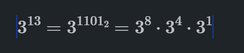

# Number Theory:  
__Topics__:  
- [Factors of a Number.](#factors-of-a-number)  
- [Prime Number.](#prime-number)  
- [Sieve of Eratosthenes.](#sieve-of-eratosthenes)  
- [Segmented Sieve.]
- [Prime Factorization.](#prime-factorization)
- [Binary and Modular Exponentiation.](#binary-exponentiation)
- [Modular Arithmetic.](#modular-arithmetic)  
- LCM and GCD.  
- Factorial and nCr.  

# Factors of a Number:  
 __Brute Force Method__: Iterate from 1 to n and check if n is divisible by i.
 ```cpp
 void factors(int n) {

    for(int i = 1; i <= n; i++) {
        if(n % i == 0) {
            cout << i << " ";
        }
    }
 }

 // complexity: O(n)
 ```

__Optimized Method__: Iterate from 1 to sqrt(n) and check if n is divisible by i and n/i.  
- __Reason__: 

```txt
     Let the number be N.
     we know N = sqrt(N) * sqrt(N).
     write it as N = a * b.
        now, if a < sqrt(N) then, for sure b > sqrt(N).
        so, we can find all the factors of N by iterating from 1 to sqrt(N).
        therefore, for each i from 1 to sqrt(N), we can find two factors i and N/i.
```

```cpp
void findFactor(int n) {
    for (int i = 1; i * i <= n>; i++) {
        if (n % i == 0) {
            cout << i << " ";
            if (i != n / i) {
                cout << n / i << " ";
            }
        }
    }
}

// complexity: O(sqrt(n))
```

# Prime Number:  
__Brute Force Method O(n)__: Check if a number is prime or not by iterating from 2 to n-1.  


__Better Method O(sqrt(n))__: We've already seen that we can find all the factors of a number by iterating from 1 to sqrt(n). So, checking if a number is prime or not can be done by iterating from 2 to sqrt(n).

```cpp
bool checkPrime(int n) {
    if(n <= 1) return false;

    for(int i = 2; i * i <= n; i++) {
        if(n % i == 0) {
            return false;
        }
    }
    return true;
}
```

# Sieve of Eratosthenes:  
__Problem__: Find all the prime numbers in 1 to n.  
__Brute Force Method__: Check if a number is prime or not by iterating from 2 to n-1.  
```cpp
void sieve(int n) {
    vector<bool> isPrime(n + 1, true);
    isPrime[0] = isPrime[1] = false;
    
    for(int i = 2; i <= n; i++) {
        if(isPrime[i]) {
            cout << i << " ";
            for(int j = 2; j <= n; j += i) {
                isPrime[j] = false;
            }
        }
    }
}

// complexity: O(n * sqrt(n))
```

__Better Method__: Check if a number is prime or not by iterating from 2 to sqrt(n).  
```cpp
 void sieve(int n) {
   vector<bool> isPrime(n + 1, true);
    isPrime[0] = isPrime[1] = false;

    for(int i = 2; i*i <= n; i++) {
        if(isPrime[i]) {
            for(int j = 2; j <= n; j += i) {
                isPrime[j] = false;
            }
        }
    }
 }

    // complexity: O(n * log(log(n)))
```

__More Optimized Method__:  The inner loop should be starts with `i*i` instead of `2` because all the numbers before `i*i` are already marked as false by the smaller prime numbers.  
```cpp
void sieve(int n) {
    vector<bool> isPrime(n + 1, true);
    isPrime[0] = isPrime[1] = false;

    for(int i = 2; i*i <= n; i++) {
        if(isPrime[i]) {
            for(int j = i*i; j <= n; j += i) {
                isPrime[j] = false;
            }
        }
    }
}

// complexity: O(n * log(log(n)))
```

# Segmented Sieve:

```cpp
int sieveArr[N+1] = {0};
vector<int>primes;

void sieve(){
    for(ll i = 2; i<=N; i++){
        if(sieveArr[i] == 0){
            primes.push_back(i);
            //mark the multiples of i as non-primes
            for(ll j = i*i; j <=N; j+=i){
                sieveArr[j] = 1; //not prime
            }
        }
    }
}
```

# Prime Factorization:  
__Problem__: Find all the prime factors of a number.  
__O(n) solution__:
```cpp
void primeFactorize(int n) {
    if(n <= 1) return;

    for(int i = 2; i <= n; i++) {
        if(n % 2 == 0) {
            int cnt = 0;
            while(n % i == 0) {
                cnt++;
                n /= i;
            }
            cout << i << "^" << cnt << " ";
        }
    }
}
```

__O(sqrt(n)) solution__:
```cpp
void primeFactorize(int n) {
    if(n <= 1)  return;

    for(int i = 2; i*i <= n; i++) {
        if(n % i == 0) {
            int cnt = 0;
            while(n % i == 0) {
                cnt++;
                n /= i;
            }
            cout<< i << "^" << cnt<<" ";
        }
    }
}
```

# Divisors of a Number:

__Problem__: Find all the divisors of a number.

```cpp
if num = (2^a) * (3^b) * (4^c)

then, the number of divisors = (a+1) * (b+1) * (c+1)
```


# Modular Arithmetic:  

__Problem__: we've to do the operations like addition, subtraction, multiplication, division, and the numbers are very large. for eg: Let A = 10^18, B = 10^18, then problem here is that we can't store the result in a variable because the result will be 10^36 which is not possible to store in a variable.

__Solution__: We can take the modulo of the result with some number.  
```cpp
(A + B) % M = ((A % M) + (B % M)) % M
(A - B) % M = ((A % M) - (B % M)) % M // double check this
(A * B) % M = ((A % M) * (B % M)) % M 
```

__(-3) % 12 = 9__

# Binary Exponentiation:
__Problem__: Find the `A` to power `B` i.e. `pow(A, B)` in `log(B)`.

### Approach 1: Using Recursion

__Intuition__:  
```txt
    A^B = A^(B/2) * A^(B/2) if B is even
    A^B = A^(B/2) * A^(B/2) * A if B is odd
```

```cpp 
int findPow(int a, int n) {
    if(n == 0) return 1;
    if(n == 1) return a;

    int x = findPow(a, n / 2);

    int result = 0;
    if(n % 2 == 0) {
        //power is even
        result = x * x;
    }else {
        result = x * x * a;
    }

    return result;
}
``` 

### Approach 2: Using Binary Representation of Exponent 
__Intution__:  
  
```txt
    A^13 = A^(1101) = A^(2^3) * A^(2^2) * A^(2^0)

    because 13 can be written as 8 + 4 + 1 = (1101) in binary
```

```cpp
int findPow(int a, int n) {
    if(n == 0) return 1;
    if(n == 1) return a;

    int result = 1;

    while(n) {
        if(n & 1)
            result *= a;

        a = a * a;
        n >>= 1;
    }

    return result;
}
```

# Modular Exponentiation:  
__Problem__: Since we've already seen that we can't store the result of large numbers in a variable, so we can take the modulo of the result with some number.  

```txt
a.b = (a % m) * (b % m) % m
```

# GCD and LCM:  
- ## GCD:  
    __Problem__: Find the greatest common divisor of two numbers.  
    __Naive Method__: Iterate from 1 to min(a, b) and check if a % i == 0 and b % i == 0.
    
    __Euclidean Algorithm__:  
    ```txt
        GCD(a, b) = GCD(b, a % b) if b != 0
        GCD(a, 0) = a
    ```

    ```cpp
    int gcd(int a, int b) {
        if(b == 0) return a;
        return gcd(b, a % b);
    }
    // complexity: O(log(min(a, b)))
    ```

- ## LCM: